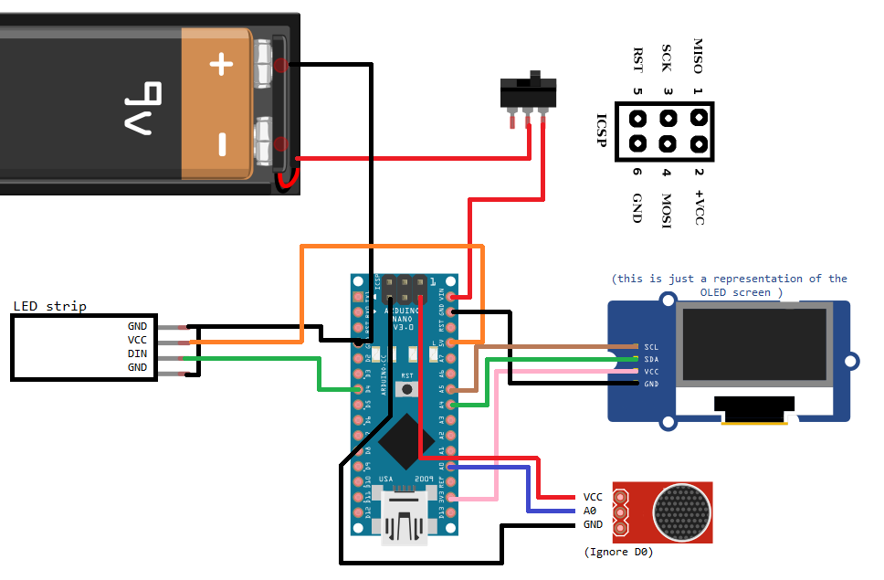
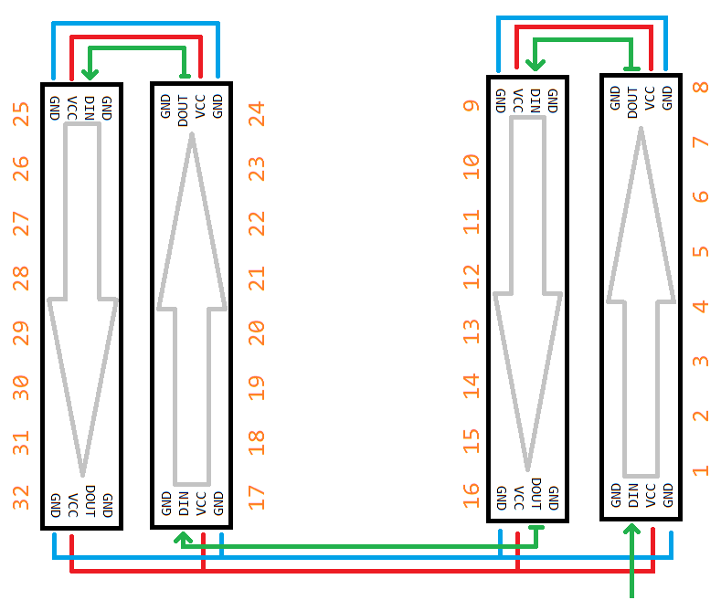
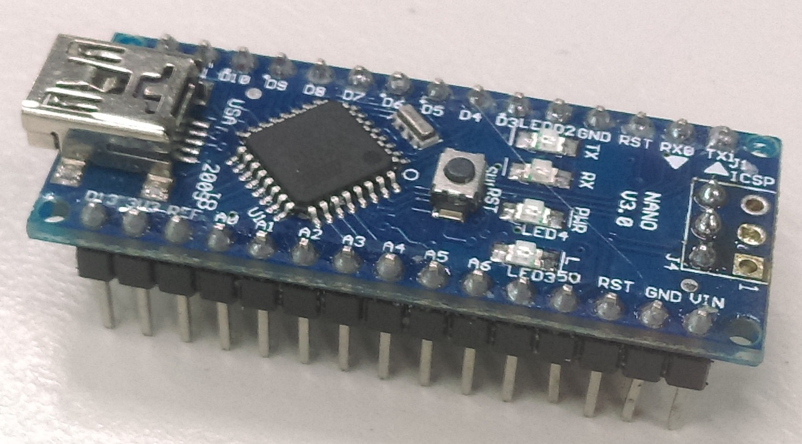
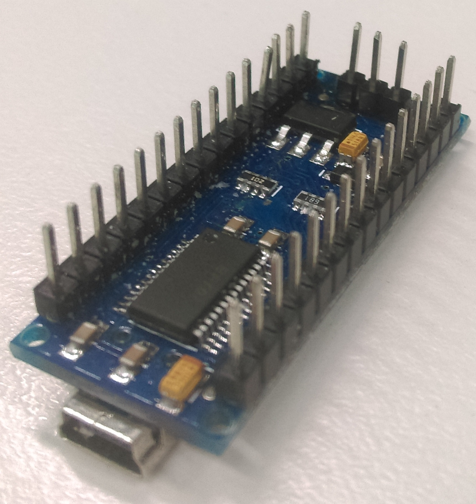
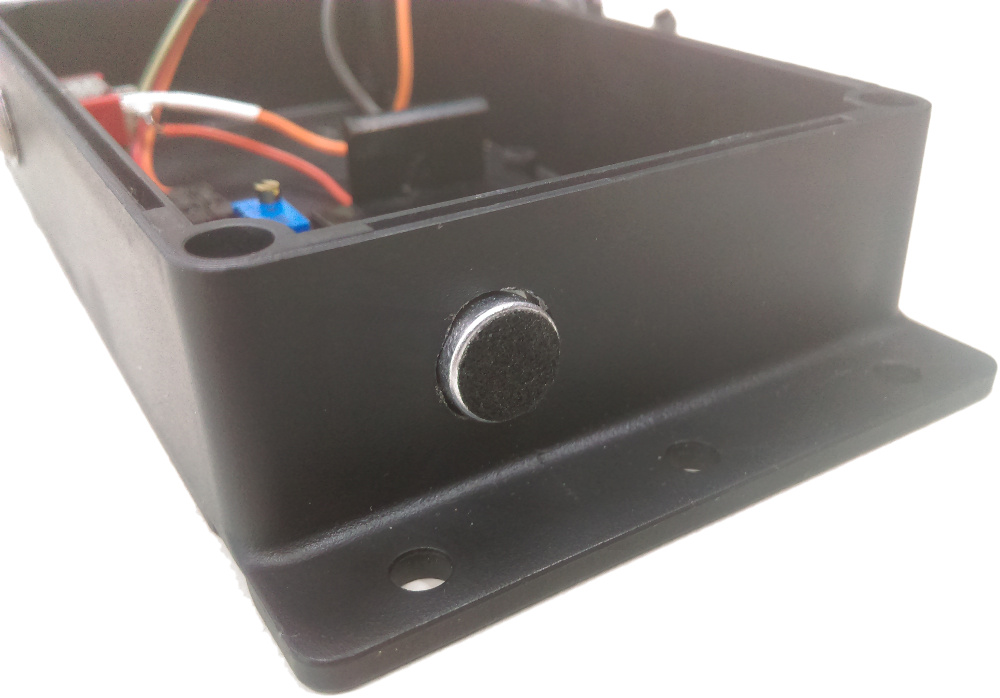
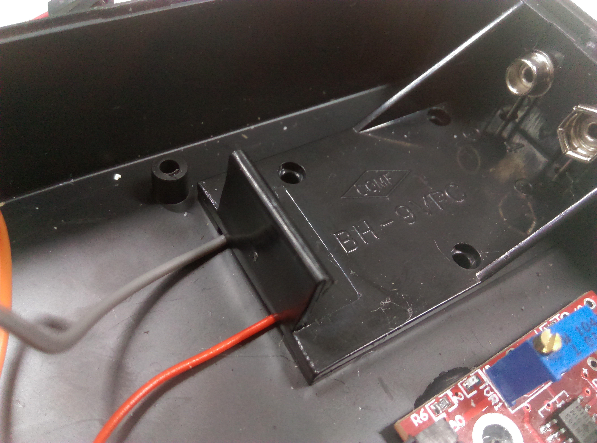
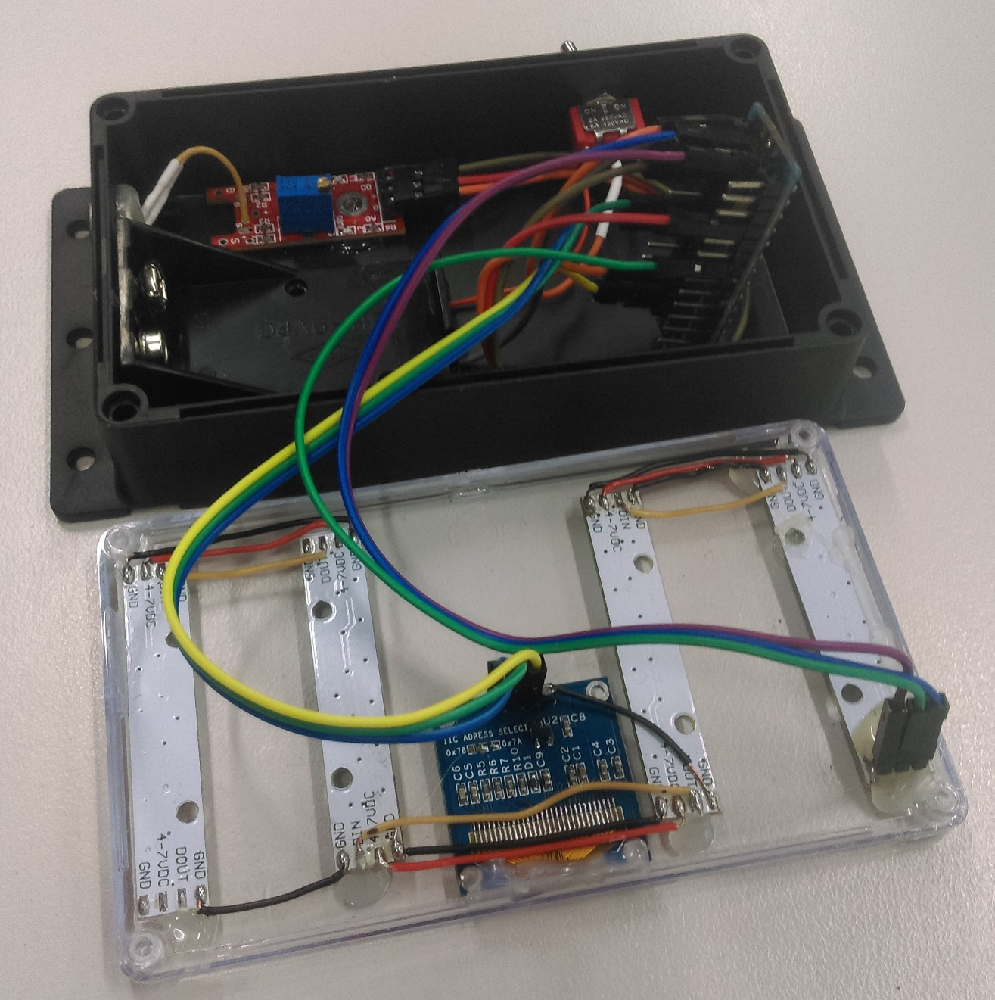

# Music Beat Bar

Pump up the Jam with this beat bar! Get a visual display that bounces in tune with the music. Uses an 8-bit-friendly Fast Fourier Transform library to detect different frequencies and pulses the bars for base, midranges, and treble. Contained in a tidy little box so you can take it and hang it up at your next party.


## Bill of Materials

|Qty| Code | Description |
|---|---|---|
|1 | [XC4414](https://jaycar.com.au/p/XC4414) | Arduino Nano
|1 | [XC4384](https://jaycar.com.au/p/XC4384) | Monochrome OLED screen
|1 | [HB6082](https://jaycar.com.au/p/HB6082) | Black enclosure
|4 | [XC4380](https://jaycar.com.au/p/XC4380) | RGB Strip module
|1 | [XC4438](https://jaycar.com.au/p/XC4438) | Microphone sound sensor module
|1 | [WC6026](https://jaycar.com.au/p/WC6026) | Socket socket jumper leads
|1 | [ST0335](https://jaycar.com.au/p/ST0335) | Toggle switch
|1 | [PH9235](https://jaycar.com.au/p/PH9235) | 9V battery module

* Solid core cables such as [WH3032](https://jaycar.com.au/p/WH3032) are always handy to have close by, as some tasks are easier with solid core wire.

## Connection table

| Nano Pin | Connection |
| :------------- | :------------- |
| A0 | Analog Module A0       |
| A4 | LCD SDA pin |
| A5 | LCD SCL pin |
| VIN | Toggle switch centre |
| D4 | LED Strip #1 DIN |

Also connect all of the VCC and 5V connections. The battery holder will connect to one side of the toggle switch, which will allow you to turn on/off the unit by feeding 9V into the `VIN` pin of the Nano.



(note, image is just a representation of the modules to show how they connect.)

Due to how limited each of the connections are, we're using absolutely every connection we can to connect with the socket-socket leads.
Each of the LED strips will be connected end to end to each other, and will make a zig-zag pattern across the front of the case, as shown in the below diagram.



It is important to ensure that each of the `DOUT` and `DIN` matches up, the DATA-OUT of one module must feed into the DATA-IN of the next module, and the DATA-IN of the first module, attaches to the Nano

## Assembly


One of the first steps is to modify the Nano so that the cables are a little more organised.



We do this by reversing the ICSP pins, following [this guide](https://jaycar.com.au/removing-headers) on how to remove them, then solder on the opposite side:



This is so now all the cables come out of one side of the nano. Next we'll fit the microphone to the outside of the case: unsolder the microphone and put 2 small wires on the leads to extend it just enough to reach the case as shown, We used some hot glue to keep the microphone in place.


From the front: the microphone will listen to the ambient sounds and feed it to the arduino. Note that the microhpone is about 9.5 mm across, so aim to drill out 9mm and file out the .5 with some [needle files](https://jaycar.com.au/p/TD2128).



The battery mount is easy enough, as you want to just bend the leads and solder on some wires so that the wires can come out from under the battery holder is placed. You will find that the battery has feet around the corners that can give enough room for the cable to slide out from underneath.



Drill a 6mm hole for the switch to mount to, and attach the positive of the battery to one of the outside switch legs, and attach a wire with one of the sockets onto the middle leg for the switch.

With the top clear panel, place the LED strips where you want, taking note of their orientation; also place the screen where you want, and find a way for you to solder it all together.

The LED strips come with 4 pin headers for each side. You will use atleast one of these to act as the starting connector from the start of your chain of LEDs.

It might be worth while to get everything prepared, and keeping it in place with bluetack so that you can check the sizes and fit of everything. We left it to chance and had to trim our GND connection on the screen, so that we could fit the vertical connector near the battery. The grond connection can just go to the closest LED ground connection of course.


You can also solder wires onto the LED panels, making sure that you check for tolerances and how it fits around the case. We opted to use one of the 4 pin connectors but ultimately regretted it when it lifted the pad and caused catastrophic damage to the LED strip. We had to end up using a lot of hot glue to support the whole assembly, which can look ugly when you're looking at it in daylight, (hopefully people only look at it at night.)



When all is said and done, connect up how the schematic shows and connect it to the computer for programming.

## Source code
The code in this project uses a library called "FHT" which has been included in with these sketch files. This file was originally created by [Open Music Labs](http://wiki.openmusiclabs.com/wiki/ArduinoFHT).

Simply download, extract, and place in your `Documents/Arduino/libraries` folder.

We want to use a Fast Fourier Transform, or an FFT, to break down audio into a series of frequencies, so we can see how loud the base / mid-range / treble is for a particular audio sample. Keep in mind that the arduino is by no means powerful, and the audio module isn't the greatest quality, so this will result in a much smaller and much noisier signal than what proper digital signal processing uses, but it is more than enough for our purposes.

The FHT library we are using, uses a more real-number friendly FFT conversion algorithm, resulting in a much faster and memory friendly response for our little Arduino.

Here's a bit of a breakdown of the different sections of code:

```c
for (int i = 0 ; i < FHT_N ; i++)
{
	while(!(ADCSRA & 0x10))
	; // wait for adc to be ready

	ADCSRA = 0xf5; // restart adc

	byte m = ADCL; // fetch adc data
	byte j = ADCH;
	int k = (j << 8) | m; // form into an int

	k -= 0x0200; // form into a signed int
	k <<= 6; // form into a 16b signed int

	fht_input[i] = k; // fill out array
}
```
We take the data out of the analog digital converter for this particular moment in time, as you can see it is a very slim slice of time so we must do this quickly, and sample a short audio segment into the `fht_input` array. We use raw bit-banging to do this, by controlling the registers manually as they say in the [ATMEL DATASHEET](http://ww1.microchip.com/downloads/en/DeviceDoc/Atmel-7810-Automotive-Microcontrollers-ATmega328P_Datasheet.pdf)

The library also recommends doing the following, so we'll do them as well:

```c
fht_window();	// window the data for better frequency response
fht_reorder();	// reorder the data before doing the fht
fht_run();		// process the data in the fht
fht_mag_log();	// take the output of the fht
```

Once the `fht_run()` function runs, the fht_log_out array has the FFT data for our small audio sample, where each of the array indexes refer to a specific frequency in the sample. Here we can just do some simple processing to make the data on the display show nicer, as well as skip the first two frequencies as they are too low to pay any attention to.

```c
//skip the first two because they are super low freq.
for(int i = 2; i < FHT_N/2; i++){
	//clear out anything that isn't better than 32
	if (fht_log_out[i] < 32) {
		fht_log_out[i] = 0;
	} else {
		fht_log_out[i] -= 32; //reduce by 32 just to get a clearer image
	}
	fht_log_out[i] *= 2; //double the strength of it
	/*continue with display*/
}
```

We then grab 4 different frequencies to correspond to how high we display on the LED bar graph, and set the bar graph accordingly.

Notice how, because the LED bar graph essentially zig-zags around the front panel, we flip the 2nd and 4th pixel orders, going from `(i%8)` to `7-(i%8)` so that all the columns appear to be oriented the same way.

## Programming

There's a few different options that you can do in regards to making your own changes this unit. One of the first ideas is to have a multi-colored rainbow sliding through each of the rows of LEDs, another is to have the screen display an audio waveform or have some sort of circular pattern that seems to popular.

With this unit being a simple Nano, there's nothing to programming it other than connecting it up to the Arduino IDE,  and pressing upload.

## Use

Simply turn the device on and put near speakers or in a loud room, the microphone will automatically pick up the beats playing in the room and will dance around on the screen accordingly.
